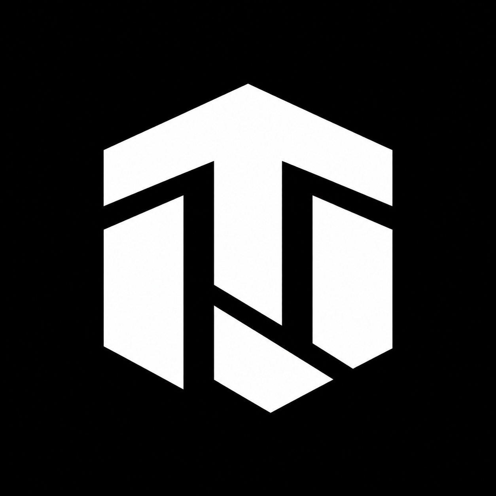
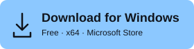
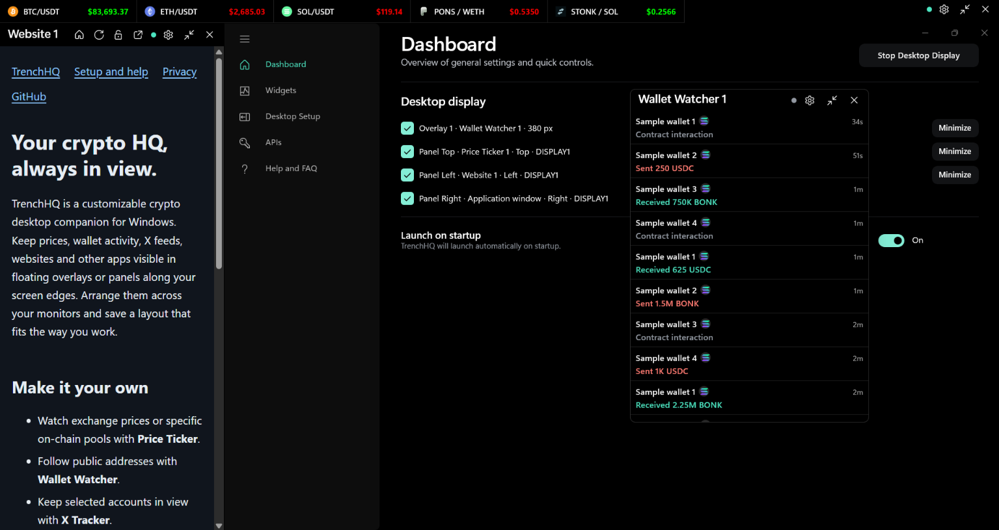
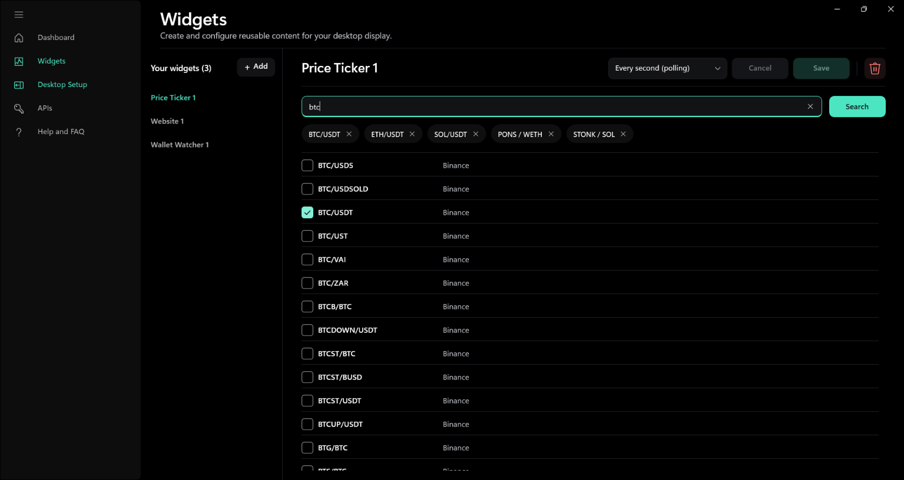
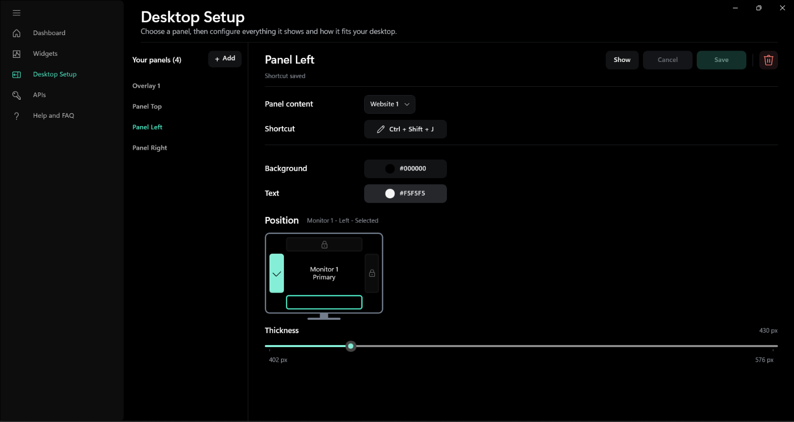

# TrenchHQ

**Your crypto HQ, always in view.**

[](https://get.microsoft.com/installer/download/9PLRS95WJKSS?referrer=appbadge)

TrenchHQ is a customizable crypto desktop companion for Windows. Keep prices,
wallet activity, X feeds, websites and other apps visible while you work, browse
or trade. Arrange them in floating overlays or panels along the edges of your
screens, across one monitor or several.

[Get started](#get-trenchhq) · [Website](https://gautamgpt1.github.io/TrenchHQ/) ·
[Setup and help](https://gautamgpt1.github.io/TrenchHQ/support.html) ·
[Discussions](https://github.com/gautamgpt1/TrenchHQ/discussions)



*Arrange prices, websites and wallet activity around your workspace. Wallet
transactions shown are sample data.*

## Make room for what you follow

Watching crypto can mean jumping between exchange tabs, wallet trackers, X and
charts. TrenchHQ gives the information you follow a place on your desktop:

- Keep a compact price ticker above your taskbar.
- Watch a wallet's activity on a second monitor.
- Put an X feed beside your charts.
- Keep a useful website or application alongside your workspace.

Choose what stays visible, where it sits and how it looks. Save your layout so
you can bring it back without arranging everything again.

## What you can put on your desktop

| Content | What you can do |
| --- | --- |
| **Price Ticker** | Follow exchange prices or a specific on-chain trading pool. |
| **Wallet Watcher** | Follow activity from public wallet addresses on supported chains. |
| **X Tracker** | Watch posts from selected accounts through the official X API. |
| **Website** | Keep a site open in its own panel, with its own saved login. |
| **Application Window** | Fit a compatible Windows app into a panel in your layout. |

Price, wallet, X and website widgets are reusable: save one, then place it in the
overlays or panels you want. Application Window is chosen directly in a panel;
you select the app to pin each session. Compatibility details are in
[setup and help](docs/public/support.md#pin-an-application).



*Create reusable widgets and choose the markets you want to follow.*

### Arrange it your way

- Float overlays above other windows or dock panels to any screen edge.
- Use several panels across multiple monitors.
- Adjust size, placement and appearance to suit your workspace.
- Save widgets and layouts, and show or hide panels with shortcuts.
- Choose whether to start with Windows and reopen the dashboard from the tray.



*Choose your panel's content, position, size, colors and keyboard shortcut.*

### Follow the market you mean

Track spot pairs on exchanges including Binance, Bybit, OKX and more, without
an exchange login or API key.

For on-chain markets, TrenchHQ supports **Solana, Ethereum, Base, BNB Smart Chain
and Robinhood Chain**. Choose the supported pool you want to watch, so the price
comes from that particular market. See the
[full exchange and chain list](docs/public/support.md#supported-markets).

### Connect your feeds

Start with public exchange prices. Add provider details in **API Connections**
when you need them for on-chain feeds. TrenchHQ selects compatible providers and
switches to available backups when a connection fails or reaches a usage limit
you have set. Some providers need an endpoint URL as well as a key.

On-chain price widgets offer **Every second (polling)** and **Live streaming**
where supported. Solana feeds need a provider; X Tracker needs your own paid X API
access. [Setup and help](docs/public/support.md#connect-data-providers) explains
what each feature needs. Detailed integration behavior lives in
[Services](docs/SERVICES.md).

## Get TrenchHQ

[](https://get.microsoft.com/installer/download/9PLRS95WJKSS?referrer=appbadge)

Free for Windows x64.
Run the downloaded **TrenchHQ Installer.exe** to install the app through Microsoft
Store. Microsoft provides the trusted signature, download and automatic updates.

You can also open the [Microsoft Store listing](https://apps.microsoft.com/detail/9PLRS95WJKSS)
or install with WinGet:

```powershell
winget install --id 9PLRS95WJKSS --source msstore
```

See [release notes](https://github.com/gautamgpt1/TrenchHQ/releases) or
[build from source](docs/BUILD.md).

### Set up your first ticker

Once the app is running:

1. In **Widgets**, create a **Price Ticker**, choose an exchange and spot pair,
   then save it. No API key is needed.
2. In **Desktop Setup**, create an overlay or screen-edge panel and assign the
   widget.
3. Select **Show**, or select panels on **Dashboard** and choose **Start Desktop
   Display**.

See [setup and help](docs/public/support.md) for the other widgets, connections
and everyday troubleshooting. The app's **Help and FAQ** is also available while
you set things up.

## Your data and accounts

TrenchHQ monitors information. It does not connect a wallet for signing, hold
funds or place trades. You can keep using your usual trading apps alongside it.

There is no TrenchHQ account or hosted account service. Feeds connect from your
device to the exchanges, providers, X and websites you use. Provider and X
credentials are protected locally by Windows; websites manage their own logins
and cookies. Read the [privacy policy](docs/public/privacy.txt) for what is stored,
what is sent and how to delete local data.

## Help and ideas

Use [Discussions](https://github.com/gautamgpt1/TrenchHQ/discussions) for questions,
ideas and sharing your setup. Found a bug or have a specific feature/integration
request? [Open an issue](https://github.com/gautamgpt1/TrenchHQ/issues/new/choose).
The [support guide](SUPPORT.md) explains what to include.

Report security problems privately using the instructions in [SECURITY.md](SECURITY.md).

## Development and contributions

Bug fixes, clearer documentation, usability improvements and integration work
are welcome. Start with [CONTRIBUTING.md](CONTRIBUTING.md).

The app uses WinUI 3/.NET with Rust and Node components. This repository contains
the application, native helpers, tests, assets and dependency locks needed to
build it; no other development checkout is required.

- [Build and test](docs/BUILD.md)
- [Architecture](docs/ARCHITECTURE.md)
- [Services and integrations](docs/SERVICES.md)
- [Release status](docs/RELEASE.md)
- [Code of Conduct](CODE_OF_CONDUCT.md)

## License

TrenchHQ is open source under the [MIT license](LICENSE). The
[brand guidelines](TRADEMARKS.md) explain use of the TrenchHQ name and logo;
third-party components retain their own [licenses and notices](THIRD_PARTY_NOTICES.md).

Created and maintained by [Gautam Gupta](https://github.com/gautamgpt1).
