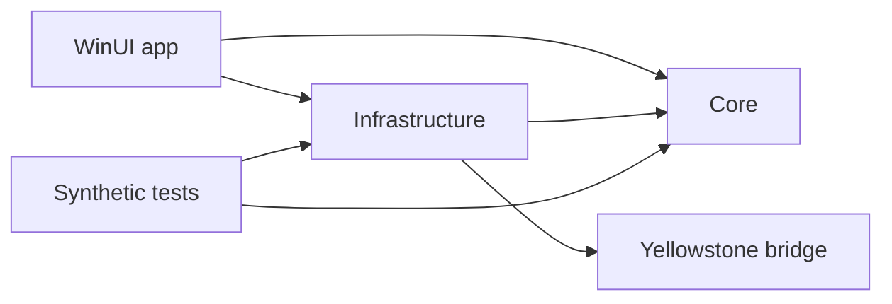

# Architecture and behavior

TrenchHQ is a read-only desktop monitor. Saved widgets describe content; panel
definitions describe placement/presentation. Application Window is panel content,
not a saved market widget. Shared content shares acquisition/cache state; each
visible panel owns its rendering and lifecycle.

## Repository and project boundaries

```text
TrenchHQ.slnx                    Visual Studio entry point
src/
  TrenchHQ.App/                  WinUI host, Views, ViewModels, Controls, assets, manifests
  TrenchHQ.Core/                 Models, contracts, validation, layout and price rules
  TrenchHQ.Infrastructure/       Acquisition, provider routing, storage, diagnostics, Win32
  TrenchHQ.OnChain.Yellowstone/   Generated protobuf/gRPC bridge
  OnChainEngine/                 Rust crate, decoders and native Rust tests
  MarketSidecar/                 Node/CCXT source and npm lock
  WindowPin/                     C++ helper and its MSBuild integration
Tests/                          Synthetic managed/Node tests and shared fixtures
tools/                          Explicit live validation and window diagnostics
Scripts/                        Dependency bootstrap, verification and packaging
ThirdParty/                     Upstream protocols, license texts and provenance
release/                        Public identity, dependency pins and export policy
docs/                           Four maintained references and public pages
```



Core targets plain .NET 8 and has no WinUI, storage implementation or network
transport dependency. Infrastructure targets Windows because it owns DPAPI,
package-local storage, connectivity and native window integration. Both are
ordinary class libraries. Tests reference these same production assemblies;
they do not recompile linked copies of production `.cs` files. Internal types
remain internal, with named friend assemblies for the app and its verification
tools. `IOnChainUsageScope` lets the provider model report usage without depending
on the persisted ledger implementation.

The WinUI app owns composition and window lifetime. Bindable editor/market rows
live in `ViewModels`; XAML event handling, dispatcher work, dialogs and native
window lifecycle stay in the app. Network-only token/pool search lives in
`Infrastructure/OnChain/TokenPoolSearchService.cs`. Protocol-specific EVM discovery
uses companion partial files sharing one RPC client and validation state. This
organization does not impose a dependency-injection framework or move native
window behavior into view models.

Feature folders group `Markets`, `Providers`, `OnChain/Evm`, `OnChain/Solana`,
`Wallets`, `Social`, `Panels`, `Widgets` and platform integration. Rust retains its
normal crate/module layout, including inline unit tests and integration fixtures;
the Node worker retains its npm project boundary.

The source directories differ from the installed payload. Packaging deliberately
retains `Assets/`, `SidecarRuntime/`, `SidecarApp/dist/` and `OnChainEngine/` so
worker startup and resource URIs remain stable. `artifacts/runtime/` contains the
downloaded, hash-checked Node runtime; all build/runtime output is ignored.
The app's sole logo source is `TrenchHQ.App/Assets/TrenchHQ.png`. MSBuild generates
the Windows icon/tile/splash variants under `obj/BrandAssets` and packages them
under `Assets`; they are not separate artwork to maintain in the source tree.

## Implementation map

| Area | Main source below `src/` |
| --- | --- |
| Host, tray and startup | `TrenchHQ.App/App.xaml.cs`, `TrenchHQ.App/MainWindow.xaml.cs`, `TrenchHQ.Infrastructure/Windows/` |
| Editors and presentation models | `TrenchHQ.App/Views/`, `TrenchHQ.App/ViewModels/` |
| Widgets and panels | `TrenchHQ.Core/Widgets/`, `TrenchHQ.Infrastructure/Widgets/`, `TrenchHQ.App/Panels/` |
| Floating/docked windows | `TrenchHQ.App/Overlay.xaml.cs`, `TrenchHQ.App/DockedBarWindow.xaml.cs` |
| Exchange feeds | `TrenchHQ.Infrastructure/Markets/`, `MarketSidecar/main.cjs` |
| Provider selection and usage | `TrenchHQ.Infrastructure/Providers/`, `TrenchHQ.Core/Providers/` |
| On-chain acquisition | `TrenchHQ.Infrastructure/OnChain/` |
| Protocol decoding/calculation | `OnChainEngine/src/`, `OnChainEngine/tests/` |
| Native pin helper | `WindowPin/`, `TrenchHQ.Infrastructure/Windows/ApplicationWindowNative.cs` |
| Diagnostics | `TrenchHQ.Infrastructure/Diagnostics/` |

## Process boundaries

The WinUI host owns user configuration and network/provider coordination. One
shared Rust engine processes bounded messages, protocol state and price updates.
The Node/CCXT sidecar serves public exchange catalogs/tickers over local pipes.
Workers start on demand, recover with bounded retry and stop when unused. Preserve
IPC size/schema validation, backpressure and equivalent-subscription idempotence.

The sidecar accepts only `getMarkets`, `setSubscriptions`, `ping` and `shutdown`.
It constructs exchanges without account credentials. Malformed frames, inherited
handler names and arbitrary/private methods are rejected. CCXT includes unused
trading/cryptographic code; the production-bundle regression verifies that it is
not exposed through IPC.

### Feed contracts and fixture maintenance

The CEX boundary is protocol v1, newline-delimited JSON. See
`src/TrenchHQ.Core/Markets/MarketFeedContracts.cs`, `src/TrenchHQ.Core/Markets/MarketFeedProtocolParser.cs` and
`src/MarketSidecar/main.cjs`. Market identity includes venue, kind and pair; asset
identity is venue-scoped. A matching symbol does not establish that two assets
are the same. Keep venue identity separate from the adapter that supplies it.
Updates require a positive finite price, matching source/market venue, and a
received timestamp. An unavailable upstream timestamp stays absent rather than
being invented. Unsupported protocol versions are rejected.

The Rust boundary is a separate protocol v2 (`trenchhq.onchain`): a four-byte
little-endian length followed by JSON, capped at 4 MiB. The host implementation
is `src/TrenchHQ.Infrastructure/OnChain/OnChainEngineClient.cs`; the engine envelope/framing is in
`src/OnChainEngine/src/ipc.rs` and dispatch is in `engine.rs`. Stdout carries only
framed messages. Credentials stay in the managed transport layer and never enter
the engine. One lazy shared engine handles all active on-chain instruments.

On-chain asset/pool identity includes the chain and validated protocol/deployment.
The same EVM address on different chains is a different identity. Manager-based
pools retain their manager and PoolId. Discovery metadata is only a candidate;
validate actual on-chain state before accepting it. Preserve exact-decimal price
math, failure/reorg handling and the distinction between spot and execution price.

Reduced public mainnet fixtures and their collection/source/block provenance are
committed under `src/OnChainEngine/tests/fixtures`; their Rust tests load them locally.
Managed synthetic transport/provider cases live in `Tests/`. Running those checks
requires no research checkout or account credentials. When changing a decoder,
add a focused positive case and relevant malformed/unsupported-state rejection;
retain provenance for recorded public data and keep expected prices independently
checkable. A captured historical fixture does not certify live account access.

## Price Ticker

- The editor toolbar labels the modes **Every second (polling)** and **Live
  streaming**, beside Cancel/Save/Delete. The selector appears only for Price
  Ticker widgets and keeps the existing saved mode values and staged edits.
- Current-state polling defaults to one second on all five chains. Each sample
  completes before the next delay; no overlapping backlog.
- Solana keeps a pool's accounts together and publishes complete snapshots
  atomically. One account uses `getAccountInfo`; larger batches use
  `getMultipleAccounts`. Standard pricing does not also request the discarded
  `slotSubscribe` feed.
- EVM polling batches due pool/reference reads through Multicall3, up to 256
  subcalls. Smaller limits are learned only after explicit size/gas rejection.
  Pure polling does not request event history, replay or wallet-finality work.
- Alchemy uses discounted number probes and a full header on the first tick
  at/after five seconds. Other providers use one full header per due tick.
  This optimization must not change displayed-price semantics.
- Live events are an explicit choice with their own replay/fork recovery rules.
  Execution-price-only pools require events. Polling does not include every trade.
- UI updates are coalesced, up to 15 per second. That display bound alone cannot
  limit provider billing; acquisition needs its own controls.
- Public CEX streaming uses CCXT; its polling fallback is five seconds.
- Prices require validated protocol state, decimals and references. Unsupported
  pools/hooks must fail clearly rather than display guessed prices.

## Editor layout and shared controls

The transparent custom title bar blends into the black page surface. The main
NavigationView's internal content border and corner radius are disabled so no
line divides the caption area from the page. Page headings extend into the
caption area with a 16-DIP top margin; do not add a separate top spacer. The
top-right Usage and desktop-display actions span the title/subtitle rows with
their own 16-DIP inset, clearing the 32-DIP caption controls. The subtitle's
lettering aligns visually with the bottom of the adjacent action. Widget and
panel titles share a
centered row with their actions at wide widths. Compact layouts move the actions
below the title. Save/error status occupies a separate row only when nonempty.
Toolbar wrapping must tolerate fractional display scaling without placing an
action over the following content.
Loading a saved widget suppresses deferred text-change notifications through the
UI queue, so normalized Website URLs and X handles do not re-enable Save/Cancel.

`src/TrenchHQ.App/App.xaml` supplies shared typography, 36-DIP standard controls, dark surfaces,
mint accents and visible focus/hover/pressed/disabled states, including dialogs.
Compact chip actions remain smaller; destructive actions remain red. Use native
control templates for standard primary/secondary buttons. Form fields, provider
badges and wallet/X entry controls must remain reachable at narrow editor widths.
Panel slider values share the label row above each track.

## Help

Help keeps one scrolling page with expandable questions under Getting started,
Widgets, Desktop panels, Connections & usage, Troubleshooting, and Privacy &
support. These are inline subheadings, not separate navigation destinations.
Questions follow setup, everyday use and recovery; implementation history does
not belong in user-facing answers. Privacy, local diagnostics and support follow
the FAQ. Keep instructions aligned with actual control labels and supported scope.

## Providers and budgets

Every saved compatible profile enters automatic per-chain selection. Supported
families share protected credentials while endpoint capabilities stay specific
to each chain. Healthy routes use hysteresis. Transient failures retry after
1/2/4/5-minute cooldowns while online. Rejected credentials wait for correction;
quota pauses recover on reset/cooldown. Idle chains generate no health probes.

PublicNode is the final EVM route and may yield to a recovered private provider.
Solana has no equivalent key-free live fallback. Exhaustion pauses an unavailable
chain without changing polling/event mode.

Known free allowances seed conservative local guards: 90% of a monthly allowance
divided by 31, or 90% of a daily allowance. Explicit overrides remain. Unknown
plans use health/quota-response handling without inventing a balance. Preserve
shared counters, persistence, pre-send checks and reset boundaries. Local estimates
cannot measure other applications' account usage.

Wallet Watcher has a separate exact-activity contract. Never apply ticker sampling
to wallet transfers/full-block requirements. Preserve bounded trace ranges,
one-minute EVM wallet finality and five-minute Solana token-account repair.

## Panels and fullscreen

Minimize and the panel shortcut toggle the same running instance. Close disposes
it; Show or Start recreates it. Stop closes panels and blocks their shortcuts.
Hidden/minimized docked panels release reserved work area.

Screen-edge thickness is capped at 30% of its monitor. Website/Application Window
enforce viable minimums. X, Website, Wallet and Application overlays use saved
content width/height; Price Ticker derives height from rows. Layout uses DIP and
must stay reachable after monitor/DPI changes.

Normal/maximized windows respect appbars. During genuine fullscreen, appbars stay
registered and panels lower behind the fullscreen app. Restore only after DWM
confirms fullscreen ended. Never resize or exit the external application to expose
a panel.

## Application Window

Native lock and experimental Embedded + lock use `SetWindowsHookEx` to load the
versioned x64 helper into the explicitly selected app's UI thread. Eligibility
checks inspect window/process metadata, architecture, responsiveness, resize
support and integrity. Admin/system and unsupported targets are excluded.

The helper does not capture input/screens, read foreign memory, extract credentials
or transmit data. Temporary attachment hooks are removed; subclass/CBT callbacks
and timers maintain bounds and recover on lease/owner loss. Hung targets must
resume message processing for recovery to complete.

Unpin, minimize, close and Quit detach and restore original window state. No target
is saved or automatically repinned. The module can stay mapped until target exit;
its verified DLL cache remains outside package data. Do not claim complete module
unload or absence of all retained files.

Cache publication is atomic. Verification shares read/delete access while denying
writes, tolerating a publisher's rename handle. Changed bytes get a new path;
damaged cached binaries are rejected before loading. Preserve concurrent-publication
and held-rename-handle regressions.

## X, websites and local data

X Tracker uses only the official paid Filtered Stream. Website embeds the site's
UI with a separate WebView2 profile per widget; shared-widget panels share its
login. Hidden views request lower memory use without claiming script suspension.
Close releases the WebView; widget deletion does not erase its browser profile.

Provider/X tokens use per-user DPAPI. Ordinary settings and public wallet labels/
addresses are not encrypted as a whole. Read [privacy](public/privacy.txt) for
network requests, cached helpers, diagnostics and deletion behavior.
