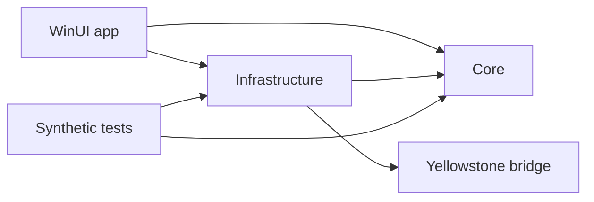

# Architecture and behavior

TrenchHQ is a customizable crypto desktop companion. Saved widgets describe content; panel
definitions describe placement/presentation. Application Window is panel content,
not a saved market widget. Shared content shares acquisition/cache state; each
visible panel owns its rendering and lifecycle.

## Repository and project boundaries

```text
TrenchHQ.slnx                    Visual Studio entry point
src/
  TrenchHQ.App/                  WinUI host, Views, ViewModels, Controls, assets, manifests
  TrenchHQ.Core/                 Models, contracts, validation, layout and price rules
  TrenchHQ.Infrastructure/       Acquisition, provider routing, storage, diagnostics, Win32
  TrenchHQ.OnChain.Yellowstone/   Generated protobuf/gRPC bridge
  OnChainEngine/                 Rust crate, decoders and native Rust tests
  MarketSidecar/                 Node/CCXT source and npm lock
  WindowPin/                     C++ helper and its MSBuild integration
Tests/                          Synthetic managed/Node tests and shared fixtures
tools/                          Explicit live validation and window diagnostics
Scripts/                        Dependency bootstrap, verification and packaging
ThirdParty/                     Upstream protocols, license texts and provenance
release/                        Public identity, dependency pins and export policy
docs/                           Four maintained references and public pages
```



Core targets plain .NET 8 and has no WinUI, storage implementation or network
transport dependency. Infrastructure targets Windows because it owns DPAPI,
package-local storage, connectivity and native window integration. Both are
ordinary class libraries. Tests reference these same production assemblies;
they do not recompile linked copies of production `.cs` files. Internal types
remain internal, with named friend assemblies for the app and its verification
tools. `IOnChainUsageScope` lets the provider model report usage without depending
on the persisted ledger implementation.

The WinUI app owns composition and window lifetime. Bindable editor/market rows
live in `ViewModels`; XAML event handling, dispatcher work, dialogs and native
window lifecycle stay in the app. Network-only token/pool search lives in
`Infrastructure/OnChain/TokenPoolSearchService.cs`. Protocol-specific EVM discovery
uses companion partial files sharing one RPC client and validation state. This
organization does not impose a dependency-injection framework or move native
window behavior into view models.

Feature folders group `Markets`, `Providers`, `OnChain/Evm`, `OnChain/Solana`,
`Wallets`, `Social`, `Panels`, `Widgets` and platform integration. Rust retains its
normal crate/module layout, including inline unit tests and integration fixtures;
the Node worker retains its npm project boundary.

The source directories differ from the installed payload. Packaging deliberately
retains `Assets/`, `SidecarRuntime/`, `SidecarApp/dist/` and `OnChainEngine/` so
worker startup and resource URIs remain stable. `artifacts/runtime/` contains the
downloaded, hash-checked Node runtime; all build/runtime output is ignored.
The app's sole logo source is `TrenchHQ.App/Assets/TrenchHQ.png`. MSBuild generates
the Windows icon/tile/splash variants under `obj/BrandAssets` and packages them
under `Assets`; they are not separate artwork to maintain in the source tree.

## Implementation map

| Area | Main source below `src/` |
| --- | --- |
| Host, tray and startup | `TrenchHQ.App/App.xaml.cs`, `TrenchHQ.App/MainWindow.xaml.cs`, `TrenchHQ.Infrastructure/Windows/` |
| Editors and presentation models | `TrenchHQ.App/Views/`, `TrenchHQ.App/ViewModels/` |
| Widgets and panels | `TrenchHQ.Core/Widgets/`, `TrenchHQ.Infrastructure/Widgets/`, `TrenchHQ.App/Panels/` |
| Floating/docked windows | `TrenchHQ.App/Overlay.xaml.cs`, `TrenchHQ.App/DockedBarWindow.xaml.cs` |
| Exchange feeds | `TrenchHQ.Infrastructure/Markets/`, `MarketSidecar/main.cjs` |
| Provider selection and usage | `TrenchHQ.Infrastructure/Providers/`, `TrenchHQ.Core/Providers/` |
| On-chain acquisition | `TrenchHQ.Infrastructure/OnChain/` |
| Protocol decoding/calculation | `OnChainEngine/src/`, `OnChainEngine/tests/` |
| Native pin helper | `WindowPin/`, `TrenchHQ.Infrastructure/Windows/ApplicationWindowNative.cs` |
| Diagnostics | `TrenchHQ.Infrastructure/Diagnostics/` |

## Process boundaries

The WinUI host owns configuration, windows and provider connections. A shared
Rust worker decodes on-chain state and calculates prices. A Node/CCXT worker
supplies public exchange markets and tickers. Workers start on demand and stop
when unused. Their local protocols validate message sizes and schemas, reject
unsupported operations and recover from worker failures.

The exchange worker exposes public market methods only. Credentials stay in the
managed provider layer and never enter the Rust worker. See [Security](../SECURITY.md)
and the [certification notes](RELEASE.md#certification-notes) for these boundaries.

Tests reference production assemblies. Use synthetic transport fixtures for
routing and recovery; protocol fixtures retain their public-data provenance.
Decoder changes need independently checkable prices and malformed-state cases.
Commands and live-test requirements are in [Build and verify](BUILD.md#verify).

## Price Ticker

- An exchange market is identified by its venue and pair. An on-chain market is
  identified by chain, protocol and pool. Matching token symbols do not establish
  that two markets or assets are the same.
- **Every second (polling)** reads current pool state. Reads are shared and batched
  where supported, and samples never overlap or accumulate a backlog.
- **Live streaming** follows supported source events. Recovery must preserve the
  correct pool state after a reconnect or chain reorganization. Pools that require
  execution events cannot silently switch to polling.
- Acquisition is shared across panels showing the same content. Rendering is
  coalesced independently; a display refresh limit does not reduce traffic that a
  provider has already delivered.
- Prices require validated state, decimals and references. Unsupported pools must
  fail clearly rather than display a guessed price.

## Wallet Watcher

Wallet Watcher follows new activity while connected. It does not load transaction
history at startup or replay missed activity after reconnection. Existing rows
can remain visible while the connection recovers.

Incoming notifications are handled independently of slower transaction-detail
requests. Duplicate notifications share detail requests. Optional enrichment and
confirmation updates must not hold up new rows. Queues and retries are bounded;
an endpoint that cannot keep up is reported rather than hiding a growing delay.

These are confirmed/block-based feeds, not mempool feeds. Transactions from one
block can arrive together. Available transfer details depend on the chain and
provider, including support for internal EVM transfers.

## Providers and usage

Saving a compatible provider makes it available for automatic selection on its
supported chains. Where supported, linked chains share the protected key. Users
do not need to pick the active connection. Healthy connections remain stable;
failures trigger retry or another eligible route without changing ticker mode.

PublicNode is the final fallback for supported EVM chains. Solana live feeds
require a configured provider. When no eligible route remains, the affected feed
pauses and reports its status. Idle chains do not generate health-check traffic.

Usage counters are estimates, not provider account balances. TrenchHQ imposes no
local allowance by default. Users can enable a limit and choose its reset cycle;
usage by other apps is not visible to TrenchHQ. Actual provider limits still apply.
Temporary throttling respects provider retry instructions; rejected credentials
and exhausted quotas are handled separately. A quota failure affects that key and
its linked chains, not unrelated credentials from the same provider.

## Editors and help

The custom title bar blends into the page. Headings and actions align at wide
widths and wrap at compact widths. Shared styles in `TrenchHQ.App/App.xaml`
define typography, controls and focus/hover states. Preserve staged edits:
loading or normalizing saved values must not turn them into unsaved changes.

Help is one scrolling FAQ with inline section headings. Explain setup, everyday
use and recovery in the user's terms. Keep implementation history out of the
interface and help text. Known layout limitations are listed in [BUILD](BUILD.md#focused-editor-ui-checks).

## Panels and fullscreen

Overlays and left/right panels show the assigned widget's name in their title
bar. Top/bottom panels omit that label to preserve space for content.

Minimize and the panel shortcut toggle the same running instance. Close disposes
it; Show or Start recreates it. Stop closes panels and blocks their shortcuts.
Hidden or minimized docked panels release their reserved work area.

Layouts use display-independent sizes and must remain reachable after monitor or
scaling changes. Normal and maximized windows respect docked panels. During true
fullscreen, panels stay registered but lower behind the fullscreen app. Restore
them only after Windows confirms fullscreen ended; never resize or exit another
application to expose a panel.

## Application Window

Native lock and experimental Embedded + lock use `SetWindowsHookEx` to load the
x64 helper into the explicitly selected app's UI thread. Eligibility checks
inspect window/process metadata, architecture, responsiveness, resize support and
integrity. Elevated, system and unsupported targets are excluded.

The helper does not capture input/screens, read foreign memory, extract credentials
or transmit data. Detach and recovery restore the original window state; hung
targets must resume message processing for recovery to finish. No target is saved
or automatically repinned.

The helper can remain mapped until the target exits, and its verified DLL cache
remains outside package data. Cache publication is atomic and changed binaries
receive a new path; damaged cached binaries must be rejected before loading.
Do not promise complete module unload or deletion of every retained file.

## X, websites and local data

X Tracker uses the official paid Filtered Stream. Website widgets have separate
WebView2 profiles; panels sharing a widget share its login. Closing a view releases
it, but deleting the widget does not erase its browser profile.

Provider and X credentials use per-user Windows DPAPI. Ordinary settings and
public wallet labels/addresses are not encrypted as a whole. The [privacy policy](public/privacy.txt)
describes network requests, diagnostics, retained data and deletion.
